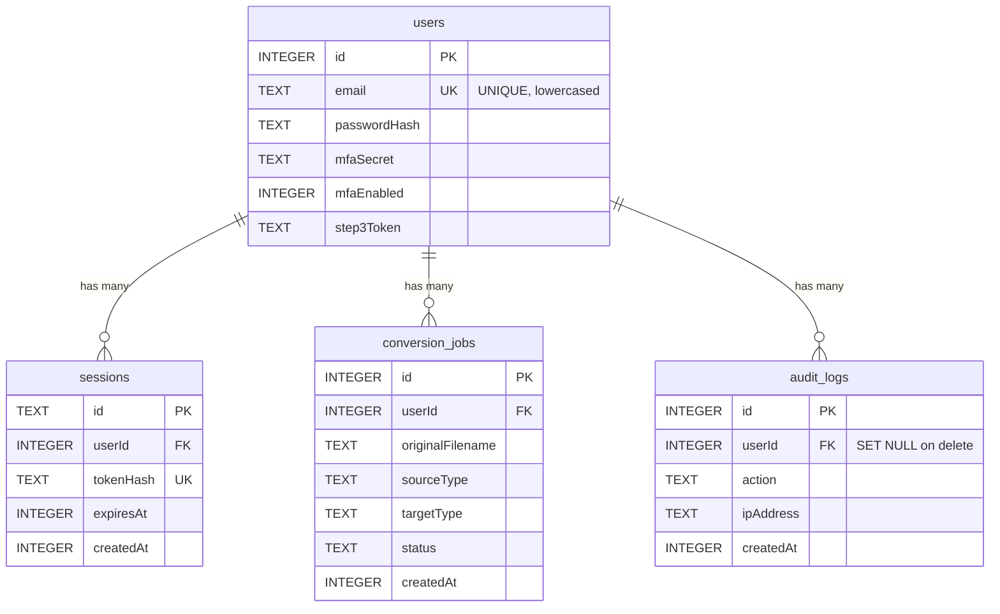

# SecureConvert — Database Design (SQLite)

This document explains the relational design backing `server/userDb.js:13`. Print it for defense — professors love to see the schema, not just screen-share.

## 1. ER Diagram (Mermaid — renders on GitHub)



**Cardinality:** `users 1 — ∞ sessions / conversion_jobs / audit_logs`. Deleting a user cascades sessions+jobs, but keeps audit trail (`SET NULL`).

## 2. DDL — What Actually Runs

Source: `server/userDb.js:10` versioned migrations + `PRAGMA user_version`.

### 2.1 Users — authentication source of truth
```sql
CREATE TABLE users (
  id INTEGER PRIMARY KEY AUTOINCREMENT,
  email TEXT UNIQUE NOT NULL,          -- UNIQUE prevents duplicate accounts at DB level, not just JS check
  passwordHash TEXT,                   -- bcrypt 12, never plaintext
  mfaSecret TEXT,                      -- Base32 TOTP seed
  mfaEnabled INTEGER DEFAULT 0,
  step3Token TEXT                      -- ephemeral tempToken between login-step1/step2
);
CREATE UNIQUE INDEX idx_users_email ON users(email);
```
**Why UNIQUE?** `authRoutes.js:19` checks `findByEmail` first, but race condition still possible — `SQLITE_CONSTRAINT` is the real guard. Index also speeds `WHERE email = ?`.

### 2.2 Sessions — JWT binding
```sql
CREATE TABLE sessions (
  id TEXT PRIMARY KEY,                 -- jti from JWT
  userId INTEGER NOT NULL,
  tokenHash TEXT UNIQUE NOT NULL,      -- SHA256(token) — stolen DB != stolen session
  expiresAt INTEGER NOT NULL,
  createdAt INTEGER NOT NULL,
  FOREIGN KEY (userId) REFERENCES users(id) ON DELETE CASCADE
);
CREATE INDEX idx_sessions_user_id ON sessions(userId);
CREATE INDEX idx_sessions_expires_at ON sessions(expiresAt);
```
**Why hash?** `userDb.js:95` never stores raw JWT. **Why expiresAt indexed?** `findSession ... WHERE expiresAt > ?` and `cleanupExpiredSessions` need fast range scan.

### 2.3 Conversion Jobs — history
```sql
CREATE TABLE conversion_jobs (
  id INTEGER PRIMARY KEY AUTOINCREMENT,
  userId INTEGER NOT NULL,
  originalFilename TEXT NOT NULL,
  sourceType TEXT NOT NULL,            -- txt/json/png detected via magic bytes
  targetType TEXT NOT NULL,            -- html/pdf/csv/webp
  status TEXT NOT NULL,
  createdAt INTEGER NOT NULL,
  FOREIGN KEY (userId) REFERENCES users(id) ON DELETE CASCADE
);
CREATE INDEX idx_conversion_jobs_user_id ON conversion_jobs(userId);
CREATE INDEX idx_conversion_jobs_created_at ON conversion_jobs(createdAt);
```

### 2.4 Audit Logs — security trace
```sql
CREATE TABLE audit_logs (
  id INTEGER PRIMARY KEY AUTOINCREMENT,
  userId INTEGER,
  action TEXT NOT NULL,                -- register_success, login_step1_success, login_step2_failed_bad_totp, convert_txt_to_html...
  ipAddress TEXT,
  createdAt INTEGER NOT NULL,
  FOREIGN KEY (userId) REFERENCES users(id) ON DELETE SET NULL
);
CREATE INDEX idx_audit_logs_user_id ON audit_logs(userId);
CREATE INDEX idx_audit_logs_created_at ON audit_logs(createdAt);
CREATE INDEX idx_audit_logs_action ON audit_logs(action);
```
Kept after user deletion for forensics.

### 2.5 Pragmas & Migrations
```sql
PRAGMA foreign_keys = ON;
PRAGMA journal_mode = WAL;             -- concurrent readers + writer
PRAGMA user_version = 2;               -- MIGRATIONS[0]=base, [1]=audit_logs+indexes
```
See `server/userDb.js:10` — `runMigrations()` applies `MIGRATIONS[version]` sequentially, not just `CREATE TABLE IF NOT EXISTS`.

## 3. Five Real Queries Your App Runs

Copy-paste these in `sqlite3 server/database.sqlite` for demo:

### Q1 — findByEmail (login)
```sql
-- server/userDb.js:54
SELECT * FROM users WHERE email = ?;  -- ? = lowercased input, parameterized, index idx_users_email
```

### Q2 — listConversionJobs (history panel, `GET /api/history`)
```sql
-- server/userDb.js:136
SELECT id, originalFilename, sourceType, targetType, status, createdAt
FROM conversion_jobs WHERE userId = ? ORDER BY createdAt DESC LIMIT ?;
-- safeLimit 1..100, uses idx_conversion_jobs_user_id + createdAt
```

### Q3 — cleanupExpiredSessions (cron / on startup)
```sql
-- server/userDb.js:122
DELETE FROM sessions WHERE expiresAt <= ?;  -- ? = Date.now(), uses idx_sessions_expires_at
```

### Q4 — listAuditLogs (security dashboard)
```sql
-- server/userDb.js:152
SELECT id, action, ipAddress, createdAt
FROM audit_logs WHERE userId = ? ORDER BY createdAt DESC LIMIT ?;
```

### Q5 — Professor's stats JOIN (show GROUP BY + JOIN)
```sql
-- not in code, but ideal for defense
SELECT u.email, COUNT(j.id) AS conversions, MAX(j.createdAt) AS lastActive
FROM users u LEFT JOIN conversion_jobs j ON j.userId = u.id
GROUP BY u.id ORDER BY conversions DESC;

-- Or: conversions by type
SELECT targetType, COUNT(*) FROM conversion_jobs GROUP BY targetType;

-- Or: failed logins by IP (from audit)
SELECT ipAddress, COUNT(*) FROM audit_logs WHERE action LIKE 'login%failed%' GROUP BY ipAddress;
```

Run `EXPLAIN QUERY PLAN` before/after index to show speed:
```bash
sqlite3 server/database.sqlite "EXPLAIN QUERY PLAN SELECT * FROM conversion_jobs WHERE userId = 1 ORDER BY createdAt DESC LIMIT 20;"
```

## 4. Integrity & Security Choices

| Choice | Where | Why professor cares |
|---|---|---|
| `UNIQUE(email)` + `UNIQUE(tokenHash)` | DDL | DB enforces invariants, not app |
| `FOREIGN KEY ... ON DELETE CASCADE` | `userDb.js:27,41` | Relational referential integrity |
| Parameterized `?` + whitelist in `updateUser` | `userDb.js:58` `ALLOWED_USER_COLUMNS` | Prevents `email'; DROP TABLE` |
| `transaction()` `BEGIN IMMEDIATE / COMMIT / ROLLBACK` | `userDb.js:98` | Atomic `createUser + updateUser`, ACID demo |
| `tokenHash = SHA256(token)` | `userDb.js:95` | Zero-trust: DB never holds bearer token |
| `LIMIT ?` sanitized `safeLimit` | `list*Jobs` | Prevents `LIMIT 999999999` DoS |

## 5. How to Demo (30 sec)

```bash
sqlite3 server/database.sqlite "SELECT name FROM sqlite_master WHERE type='table';"
sqlite3 server/database.sqlite "SELECT sql FROM sqlite_master WHERE name='users';"
sqlite3 server/database.sqlite "SELECT email, mfaEnabled FROM users LIMIT 3;"
# Try injection — blocked:
curl -X POST http://127.0.0.1:5000/api/auth/register -H "Content-Type: application/json" -d '{"email":"a@b.com'\'' OR 1=1--","password":"12345678"}'
```

Add this file to your report appendix — it's exactly what DB-loving professors grade for.
